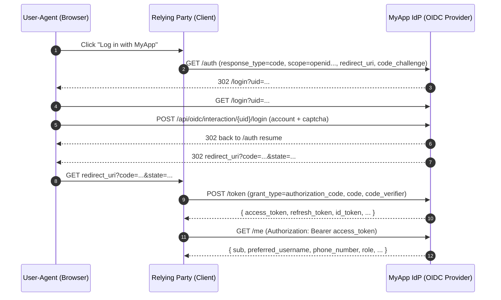

# OIDC 接入指南（Authorization Code + PKCE）

本项目同时提供两种能力：

- **作为 OIDC Provider (IdP)**：对外提供 OAuth2/OIDC 标准接口（Issuer 位于 `/api/oidc`）。
- **作为平台自身（账号中心）**：平台内登录/注销就是普通网站的登录/注销（手机号/验证码），形成全局 SSO 会话；第三方接入才走 OIDC 授权与授权提示。

---

## 1. 关键地址

假设你的 `OIDC_ISSUER` 为：

```
https://example.com/api/oidc
```

则常用端点为：

- Discovery: `https://example.com/api/oidc/.well-known/openid-configuration`
- Authorization: `https://example.com/api/oidc/auth`
- Token: `https://example.com/api/oidc/token`
- UserInfo: `https://example.com/api/oidc/me`
- JWKS: `https://example.com/api/oidc/jwks`
- Introspection: `https://example.com/api/oidc/token/introspection`
- Revocation: `https://example.com/api/oidc/token/revocation`

---

## 2. 授权码模式流程图（Mermaid）



---

## 3. Client（第三方应用）管理

当前项目提供管理员 API（需登录且为 `ADMIN`）用于 CRUD：

- 列表/创建：`GET/POST /api/admin/oidc/clients`
- 详情/更新/删除：`GET/PUT/DELETE /api/admin/oidc/clients/{client_id}`

创建 Client 时的关键字段：

- `client_id`：唯一标识
- `client_secret`：密钥（建议随机生成并妥善保管）
- `redirect_uris`：允许的回调地址数组（必须严格匹配）
- `grant_types`：建议 `["authorization_code","refresh_token"]`
- `response_types`：建议 `["code"]`
- `token_endpoint_auth_method`：建议 `client_secret_basic`
- `is_first_party`：是否为第一方（受信任应用，跳过授权提示）
    - 你的第一方应用可以设为 `true`（类似 Google 自家产品）
    - 第三方网站请保持 `false`（需要授权提示）

---

## 4. 混合模式接入（绑定本地账号）

适用于第三方已有账号体系：通过 “Log in with MyApp” 获取用户身份信息，然后绑定到其本地用户。

建议流程：

1. 第三方引导用户走 **授权码 + PKCE** 登录。
2. 第三方拿到 `access_token` 后调用 `GET /me` 获取用户信息（至少包含 `sub`）。
3. 第三方在自己的数据库中做绑定：
    - 若已存在绑定（`provider = myapp`, `provider_sub = sub`）→ 登录到对应本地账号
    - 否则提示用户选择/创建本地账号并完成绑定

建议绑定键：

- `issuer` + `sub`（避免未来多环境/多实例 issuer 不同导致冲突）

### 4.1 推荐表结构（示例）

建议在第三方数据库里增加一张“外部身份绑定表”（字段名可自行调整）：

**Prisma（示例）**

```prisma
model OidcAccountLink {
  id          String   @id @default(uuid())
  createdAt   DateTime @default(now())
  updatedAt   DateTime @updatedAt

  // 例如：https://example.com/api/oidc
  issuer      String

  // MyApp 的用户唯一标识（稳定主键）
  sub         String

  // 你第三方本地账号 ID
  localUserId String

  @@unique([issuer, sub])
  @@index([localUserId])
}
```

### 4.2 回调处理（伪代码）

下面示例展示第三方后端在回调时如何完成“换 token -> 拉取用户信息 -> 绑定/登录”。

```js
import { Issuer } from "openid-client"

const ISSUER = process.env.MYAPP_OIDC_ISSUER
const CLIENT_ID = process.env.MYAPP_CLIENT_ID
const CLIENT_SECRET = process.env.MYAPP_CLIENT_SECRET
const REDIRECT_URI = process.env.MYAPP_REDIRECT_URI

export async function myappCallback(req, res) {
    const issuer = await Issuer.discover(ISSUER)

    const client = new issuer.Client({
        client_id: CLIENT_ID,
        client_secret: CLIENT_SECRET,
        redirect_uris: [REDIRECT_URI],
        response_types: ["code"],
    })

    const params = client.callbackParams(req)
    const tokenSet = await client.callback(REDIRECT_URI, params, {
        // PKCE 场景下需要 code_verifier，请从你自己的 session 里取出
        code_verifier: req.session.codeVerifier,
        state: req.session.state,
    })

    const userinfo = await client.userinfo(tokenSet.access_token)
    const sub = String(userinfo.sub)

    // 绑定键：issuer + sub
    const link = await db.oidcAccountLink.findUnique({ issuer: ISSUER, sub })

    if (link)
        return (
            // 已绑定：登录到第三方本地账号
            loginAsLocalUser(res, link.localUserId)
        )

    // 未绑定：
    // 1) 如果用户已登录第三方本地账号，则直接绑定
    // 2) 否则引导用户创建/选择本地账号后再绑定
    return res.redirect("/bind-myapp")
}
```

---

## 5. 纯净模式接入（仅依赖本 IdP）

适用于第三方不自建账号：完全以 `sub` 作为用户主键，或直接把 `sub` 映射为其用户 ID。

后端鉴权建议：

- 接收第三方前端携带的 `Authorization: Bearer <access_token>`
- 后端通过 **Introspection** 校验 token 是否有效，并读取 `sub`/scope 等信息

注意：

- 本 IdP 开启了 Refresh Token，并启用 **Refresh Token Rotation**（刷新会下发新的 refresh token 并废弃旧的）。
- Access Token TTL：1 小时；Refresh Token TTL：30 天。

### 5.1 用户落库（建议）

纯净模式下，第三方可以只维护一张很薄的用户表：

- `sub` 作为主键（或唯一键）
- 可选字段：`createdAt`、`lastLoginAt`、`profileSnapshot`

### 5.2 Access Token 校验方式选择

本项目默认建议第三方资源服务器使用 **Introspection** 进行校验（最通用，支持撤销与旋转）。

如果你未来将 Access Token 配置为 JWT 并允许第三方离线验签，则第三方也可以走 “JWKS 验签” 路线。

---

## 6. “Google 风格”的登录/登出与授权提示规则（本项目实现）

为对齐 Google 的体验与规范，本项目按如下规则工作：

- **平台自身登录**：用户访问平台时，只看到普通登录页（手机号/验证码），不会出现授权提示。
- **平台自身注销**：注销的是账号中心（IdP 的全局 SSO 会话），但不会强制退出任何已经登录的第三方网站。
- **第三方登录（Log in with MyApp）**：首次授权或新增权限时，会出现授权确认页；已授权且权限不变时，通常不会重复弹出。
- **第三方注销**：第三方只需要清理自己站点的会话，不应触发 IdP 全局注销，也不会影响其他第三方。

备注：本项目默认不对外提供 RP-Initiated Logout（第三方不应通过“标准 end_session”来登出账号中心）。

---

## 7. 用户侧：已连接的应用（撤销授权）

类似 Google 的“已连接的应用/第三方访问”能力：用户可以查看并撤销某个第三方的授权。

- 页面：`/connected-apps`
- 撤销授权后：该第三方持有的 Refresh Token 将失效（已登录的第三方站点不会被强制退出）。

---

## 8. 接口鉴权示例（Node.js 中间件：Introspection）

下面示例演示第三方（资源服务器）如何在后端校验 Access Token：

```js
// Express/Koa 类似思路：用 introspection 校验 bearer token
import fetch from "node-fetch"

const ISSUER = process.env.MYAPP_OIDC_ISSUER // e.g. https://example.com/api/oidc
const INTROSPECTION = `${ISSUER}/token/introspection`

// 资源服务器作为一个 OIDC Client，需要有 client_id / client_secret
const CLIENT_ID = process.env.MYAPP_CLIENT_ID
const CLIENT_SECRET = process.env.MYAPP_CLIENT_SECRET

export function requireMyAppAuth(requiredScopes = []) {
    return async (request, response, next) => {
        try {
            const authorizationHeader = request.headers.authorization || ""
            const [, token] = authorizationHeader.split(" ")
            if (!token) return response.status(401).json({ message: "Missing bearer token" })

            const body = new URLSearchParams({ token })
            const introspectionResponse = await fetch(INTROSPECTION, {
                method: "POST",
                headers: {
                    "content-type": "application/x-www-form-urlencoded",
                    authorization: "Basic " + Buffer.from(`${CLIENT_ID}:${CLIENT_SECRET}`).toString("base64"),
                },
                body,
            })

            if (!introspectionResponse.ok) return response.status(401).json({ message: "Introspection failed" })
            const data = await introspectionResponse.json()
            if (!data.active) return response.status(401).json({ message: "Token inactive" })

            const tokenScopes = (data.scope || "").split(" ").filter(Boolean)

            for (const scope of requiredScopes) {
                if (!tokenScopes.includes(scope)) return response.status(403).json({ message: "Insufficient scope" })
            }

            // 关键：sub 即用户主键
            request.user = { sub: data.sub, scope: tokenScopes, client_id: data.client_id }
            return next()
        } catch (error) {
            return response.status(401).json({ message: "Unauthorized" })
        }
    }
}
```

---

## 9. 接口鉴权示例（可选：JWT + JWKS 验签）

说明：该方式仅适用于 Access Token 为 JWT 的场景。默认情况下建议继续使用 Introspection。

```js
import { createRemoteJWKSet, jwtVerify } from "jose"

const ISSUER = process.env.MYAPP_OIDC_ISSUER // 例如：https://example.com/api/oidc
const JWKS = createRemoteJWKSet(new URL(`${ISSUER}/jwks`))

export function requireMyAppJwtAuth(requiredScopes = []) {
    return async (req, res, next) => {
        try {
            const authorizationHeader = req.headers.authorization || ""
            const [, token] = authorizationHeader.split(" ")
            if (!token) return res.status(401).json({ message: "Missing bearer token" })

            const { payload } = await jwtVerify(token, JWKS, {
                issuer: ISSUER,
            })

            const scopes = String(payload.scope || "")
                .split(" ")
                .filter(Boolean)

            for (const scope of requiredScopes) {
                if (!scopes.includes(scope)) return res.status(403).json({ message: "Insufficient scope" })
            }

            req.user = { sub: String(payload.sub), scope: scopes, client_id: String(payload.client_id || "") }
            return next()
        } catch (error) {
            return res.status(401).json({ message: "Unauthorized" })
        }
    }
}
```
