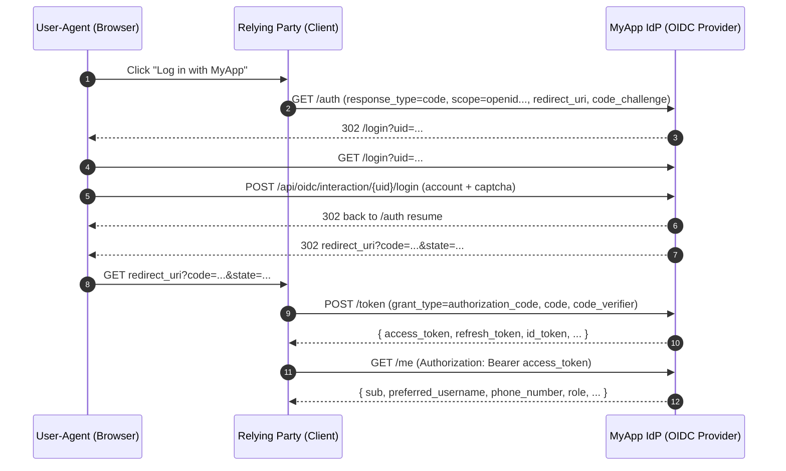

# OIDC 接入指南（Authorization Code + PKCE）

本项目同时提供两种能力：

- **作为 OIDC Provider (IdP)**：对外提供 OAuth2/OIDC 标准接口（Issuer 位于 `/api/oidc`）。
- **作为普通应用（Dogfooding）**：自身也通过 OIDC（`next-auth`）接入同一个 IdP，不再使用自建 Cookie/JWT 登录态。

---

## 1. 关键地址

假设你的 `OIDC_ISSUER` 为：

```
https://example.com/api/oidc
```

则常用端点为：

- Discovery: `https://example.com/api/oidc/.well-known/openid-configuration`
- Authorization: `https://example.com/api/oidc/auth`
- Token: `https://example.com/api/oidc/token`
- UserInfo: `https://example.com/api/oidc/me`
- JWKS: `https://example.com/api/oidc/jwks`
- Introspection: `https://example.com/api/oidc/token/introspection`
- Revocation: `https://example.com/api/oidc/token/revocation`

---

## 2. 授权码模式流程图（Mermaid）



---

## 3. Client（第三方应用）管理

当前项目提供管理员 API（需登录且为 `ADMIN`）用于 CRUD：

- 列表/创建：`GET/POST /api/admin/oidc/clients`
- 详情/更新/删除：`GET/PUT/DELETE /api/admin/oidc/clients/{client_id}`

创建 Client 时的关键字段：

- `client_id`：唯一标识
- `client_secret`：密钥（建议随机生成并妥善保管）
- `redirect_uris`：允许的回调地址数组（必须严格匹配）
- `grant_types`：建议 `["authorization_code","refresh_token"]`
- `response_types`：建议 `["code"]`
- `token_endpoint_auth_method`：建议 `client_secret_basic`

---

## 4. 混合模式接入（绑定本地账号）

适用于第三方已有账号体系：通过 “Log in with MyApp” 获取用户身份信息，然后绑定到其本地用户。

建议流程：

1. 第三方引导用户走 **授权码 + PKCE** 登录。
2. 第三方拿到 `access_token` 后调用 `GET /me` 获取用户信息（至少包含 `sub`）。
3. 第三方在自己的数据库中做绑定：
    - 若已存在绑定（`provider = myapp`, `provider_sub = sub`）→ 登录到对应本地账号
    - 否则提示用户选择/创建本地账号并完成绑定

建议绑定键：

- `issuer` + `sub`（避免未来多环境/多实例 issuer 不同导致冲突）

---

## 5. 纯净模式接入（仅依赖本 IdP）

适用于第三方不自建账号：完全以 `sub` 作为用户主键，或直接把 `sub` 映射为其用户 ID。

后端鉴权建议：

- 接收第三方前端携带的 `Authorization: Bearer <access_token>`
- 后端通过 **Introspection** 校验 token 是否有效，并读取 `sub`/scope 等信息

注意：

- 本 IdP 开启了 Refresh Token，并启用 **Refresh Token Rotation**（刷新会下发新的 refresh token 并废弃旧的）。
- Access Token TTL：1 小时；Refresh Token TTL：30 天。

---

## 6. 接口鉴权示例（Node.js 中间件：Introspection）

下面示例演示第三方（资源服务器）如何在后端校验 Access Token：

```js
// Express/Koa 类似思路：用 introspection 校验 bearer token
import fetch from "node-fetch"

const ISSUER = process.env.MYAPP_OIDC_ISSUER // e.g. https://example.com/api/oidc
const INTROSPECTION = `${ISSUER}/token/introspection`

// 资源服务器作为一个 OIDC Client，需要有 client_id / client_secret
const CLIENT_ID = process.env.MYAPP_CLIENT_ID
const CLIENT_SECRET = process.env.MYAPP_CLIENT_SECRET

export function requireMyAppAuth(requiredScopes = []) {
    return async (request, response, next) => {
        try {
            const authorizationHeader = request.headers.authorization || ""
            const [, token] = authorizationHeader.split(" ")
            if (!token) return response.status(401).json({ message: "Missing bearer token" })

            const body = new URLSearchParams({ token })
            const introspectionResponse = await fetch(INTROSPECTION, {
                method: "POST",
                headers: {
                    "content-type": "application/x-www-form-urlencoded",
                    authorization: "Basic " + Buffer.from(`${CLIENT_ID}:${CLIENT_SECRET}`).toString("base64"),
                },
                body,
            })

            if (!introspectionResponse.ok) return response.status(401).json({ message: "Introspection failed" })
            const data = await introspectionResponse.json()
            if (!data.active) return response.status(401).json({ message: "Token inactive" })

            const tokenScopes = (data.scope || "").split(" ").filter(Boolean)

            for (const scope of requiredScopes) {
                if (!tokenScopes.includes(scope)) return response.status(403).json({ message: "Insufficient scope" })
            }

            // 关键：sub 即用户主键
            request.user = { sub: data.sub, scope: tokenScopes, client_id: data.client_id }
            return next()
        } catch (error) {
            return response.status(401).json({ message: "Unauthorized" })
        }
    }
}
```
